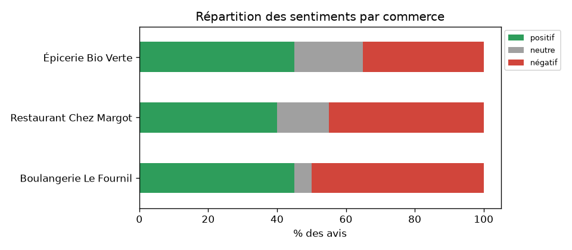
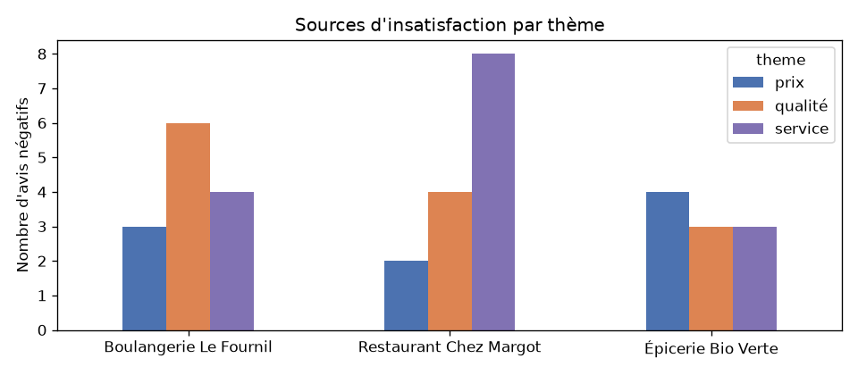

# Rapport d'analyse des avis clients

**60 avis analysés** sur 3 commerces.

## Répartition des sentiments (%)

| commerce               |   positif |   neutre |   négatif |
|:-----------------------|----------:|---------:|----------:|
| Boulangerie Le Fournil |        45 |        5 |        50 |
| Restaurant Chez Margot |        40 |       15 |        45 |
| Épicerie Bio Verte     |        45 |       20 |        35 |

## Avis négatifs par thématique

| commerce               |   prix |   qualité |   service |
|:-----------------------|-------:|----------:|----------:|
| Boulangerie Le Fournil |      3 |         6 |         4 |
| Restaurant Chez Margot |      2 |         4 |         8 |
| Épicerie Bio Verte     |      4 |         3 |         3 |

## Actions prioritaires

### Boulangerie Le Fournil → améliorer **qualité**

6 avis négatifs sur 15 mentions (40 %). Exemples :

- Croissants secs et tarif excessif pour la qualité
- Baguettes mal cuites, déception de client fidèle.
- Gâteaux beaux mais trop sucrés.

### Restaurant Chez Margot → améliorer **service**

8 avis négatifs sur 14 mentions (57 %). Exemples :

- Longue attente sans excuses pour le plat principal
- Viande trop cuite et serveur contestataire
- Serveuse désagréable et pressante avec les clients.

### Épicerie Bio Verte → améliorer **prix**

4 avis négatifs sur 9 mentions (44 %). Exemples :

- Prix des pommes considérés comme trop élevés à six euros
- Personnel froid et produits trop chers sans aide client
- Double facturation refusée de vérification par la caissière
